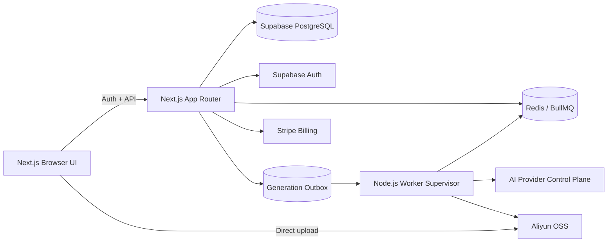

<div align="center">

# Pixel Diffusion

**Open-source AI fashion and e-commerce visual production workspace**

[](https://github.com/ganjmeng/wanxiangzy/actions/workflows/ci.yml)
[](LICENSE)
[](package.json)
[](package.json)
[](package.json)
[](package.json)
[](docs/CONFIGURATION.md)
[](docs/ARCHITECTURE.md)
[](docs/CONFIGURATION.md)
[](CONTRIBUTING.md)

[English](README.md) | [简体中文](README.zh-CN.md)

[Live service](https://pixel-diffusion.com) · [Configuration](docs/CONFIGURATION.md) · [Architecture](docs/ARCHITECTURE.md) · [Contributing](CONTRIBUTING.md)

</div>


Pixel Diffusion is a production-oriented workspace for AI-assisted fashion and e-commerce imagery. It combines virtual try-on, pose variation, model generation, product retouching, product sets, background replacement, material enhancement, image translation, garment 3D, and image-to-video workflows in one application.

The repository is the complete application source: Next.js UI, API routes, Supabase schema, AI provider control plane, background workers, billing integration, administration console, and deployment automation.

> [!IMPORTANT]
> This repository does not include production credentials, a hosted database, object storage, Redis, Stripe products, or AI provider accounts. Self-hosting requires your own infrastructure and provider configuration. Never commit real secrets.

## Highlights

- **End-to-end visual workflows** — try-on, outfit fusion, pose generation, model assets, product sets, product retouching, image translation, background replacement, material enhancement, and AI video.
- **Provider-neutral AI control plane** — image, vision, text, and video providers are configured in the admin console and encrypted at rest instead of being scattered across environment variables.
- **Durable generation pipeline** — PostgreSQL transactional outbox, BullMQ delivery, execution fencing, idempotent settlement, retries, refunds, and capacity backpressure.
- **Production-grade storage path** — browser-to-Aliyun OSS direct uploads, bounded server-side fetches, result persistence, media validation, and retention cleanup.
- **Built-in SaaS foundation** — Supabase Auth, PostgreSQL, credits, Stripe billing, subscriptions, refunds, invite rewards, audit logging, and an administration console.
- **Internationalized interface** — multiple locales, RTL support, responsive layouts, light/dark themes, and accessibility-oriented UI primitives.

## Product Screenshots

<table>
  <tr>
    <td width="50%" valign="top">
      <a href="https://vasthk.oss-cn-hongkong.aliyuncs.com/site-assets/original/home-showcase/screen-tryon-result.png">
        
      </a>
      <sub><b>Virtual try-on</b> — garment fidelity, reference-guided pose, and model consistency.</sub>
    </td>
    <td width="50%" valign="top">
      <a href="https://vasthk.oss-cn-hongkong.aliyuncs.com/site-assets/original/home-showcase/screen-pose-result-grid.png">
        
      </a>
      <sub><b>Pose variation</b> — multiple commercial poses from one source image while preserving garment details.</sub>
    </td>
  </tr>
</table>

<a href="https://vasthk.oss-cn-hongkong.aliyuncs.com/site-assets/original/home-showcase/screen-fusion-grid-reference.png">
  
</a>

<sub><b>Outfit fusion</b> — combine garments, accessories, references, and model inputs into consistent campaign-ready looks.</sub>

## Architecture



Read [docs/ARCHITECTURE.md](docs/ARCHITECTURE.md) for request flows, generation state transitions, trust boundaries, and runtime invariants.

## Tech Stack

| Layer | Technology |
| --- | --- |
| Application | Next.js 15, React 19, TypeScript |
| UI | Tailwind CSS, Radix Primitives, Lucide, Framer Motion |
| State | Zustand, React context |
| Auth and data | Supabase Auth, PostgreSQL, Row Level Security |
| Queue and workers | BullMQ, Redis, PostgreSQL transactional outbox |
| Media | Aliyun OSS, Sharp, ffprobe |
| Billing | Stripe subscriptions, one-time purchases, webhooks |
| AI routing | Admin-configurable encrypted provider control plane |
| Quality | ESLint, TypeScript, Vitest, Playwright, custom release gates |

## Quick Start

### Prerequisites

- Node.js 22.x (`>=22 <23`)
- npm 10+
- A Supabase project
- Redis 7+ for BullMQ-backed development and production
- Aliyun OSS for production uploads and result persistence
- `ffprobe` when media validation is enabled

### 1. Clone and install

```bash
git clone https://github.com/ganjmeng/wanxiangzy.git
cd wanxiangzy
npm ci
```

### 2. Configure the environment

```bash
cp .env.local.example .env.local
```

At minimum, configure the Supabase and storage values required by the features you intend to run. Generate independent secrets locally; never reuse example values:

```bash
openssl rand -hex 32   # JOB_PROCESSOR_SECRET
openssl rand -hex 32   # UPLOAD_INTENT_SECRET
openssl rand -hex 32   # ADMIN_SECRETS_ENCRYPTION_KEY
```

See [docs/CONFIGURATION.md](docs/CONFIGURATION.md) for the complete variable contract and production requirements.

### 3. Initialize Supabase

Apply the base SQL files and timestamped migrations in the documented order:

```bash
export SUPABASE_DB_URL='postgresql://...'

psql "$SUPABASE_DB_URL" -v ON_ERROR_STOP=1 -f supabase/schema.sql
psql "$SUPABASE_DB_URL" -v ON_ERROR_STOP=1 -f supabase/credits-update.sql
psql "$SUPABASE_DB_URL" -v ON_ERROR_STOP=1 -f supabase/set-signup-credits-50.sql
psql "$SUPABASE_DB_URL" -v ON_ERROR_STOP=1 -f supabase/atomic-credit-rpc.sql
psql "$SUPABASE_DB_URL" -v ON_ERROR_STOP=1 -f supabase/admin-console.sql
```

Continue with [docs/supabase-migration-order.md](docs/supabase-migration-order.md). Several timestamped migrations are intentionally ordered and one early group is destructive; always back up before applying them to an existing environment.

### 4. Create the first admin without manual registration

The command below calls the Supabase Admin API with `SUPABASE_SERVICE_ROLE_KEY`, creates an email-confirmed Auth user, and writes the matching row in `public.admin_members`:

```bash
npm run admin:create -- --email owner@example.com --role owner
```

If `--password` is omitted, the script generates a strong password and prints it once. Re-running the command reuses an existing Auth user and keeps the existing password unless `--update-password` is supplied. `ADMIN_BOOTSTRAP_EMAILS` is not required for this path.

See [docs/admin-bootstrap.md](docs/admin-bootstrap.md) for roles, verification queries, and the emergency environment bootstrap fallback.

### 5. Start the application

For a minimal UI/API development loop, set `GENERATION_QUEUE_MODE=inline` in `.env.local`:

```bash
npm run dev
```

For queue-backed development, keep `GENERATION_QUEUE_MODE=bullmq`, configure `REDIS_URL`, and run the worker in a second terminal:

```bash
npm run dev
npm run worker:dev
```

Open [http://localhost:3000](http://localhost:3000).

## Development Commands

| Command | Purpose |
| --- | --- |
| `npm run dev` | Start the Next.js development server |
| `npm run worker:dev` | Start the background worker supervisor in watch mode |
| `npm run test` | Run the Vitest suite |
| `npm run lint` | Run ESLint |
| `npm run typecheck` | Run TypeScript without emitting files |
| `npm run build` | Create a production build |
| `npm run admin:create -- --email owner@example.com` | Create or grant an admin account without manual signup |
| `npm run check:release` | Run tests, prompt checks, lint, typecheck, build, and SSR size checks |
| `npm run check:ssr-size` | Inspect server bundle size against the configured budget |

Before opening a pull request, run:

```bash
npm run check:release
```

## Production Deployment

Production builds must be created locally and uploaded to the target host. Do not run `next build` on a memory-constrained production server.

```bash
SSH_HOST=<host> \
SSH_KEY=<path-to-pem> \
NODE_BIN=<remote-node-22-binary> \
./scripts/deploy-from-local.sh <tag> [worker_instances]
```

The GitHub Actions deployment workflow is a manual fallback only. Pushing a Git tag must not trigger an automatic production deployment. See [docs/release-checklist.md](docs/release-checklist.md).

## Project Structure

```text
app/                  Next.js pages and route handlers
components/           Shared UI and application components
features/             Feature-oriented client workflows
lib/                  Domain logic, providers, queues, billing, storage
scripts/              Build, worker, migration, audit, and deploy scripts
supabase/             Schema and ordered SQL migrations
messages/             Localized UI messages
docs/                 Architecture and operations documentation
```

## Documentation

- [Configuration reference](docs/CONFIGURATION.md)
- [Architecture](docs/ARCHITECTURE.md)
- [Supabase migration order](docs/supabase-migration-order.md)
- [Production generation queue](docs/production-generation-queue.md)
- [OSS upload data plane](docs/production-upload-data-plane.md)
- [Provider result to OSS pipeline](docs/provider-result-oss-pipeline.md)
- [AWS EC2 release checklist](docs/release-checklist.md)
- [Backup and restore](docs/backup-restore.md)
- [Admin bootstrap](docs/admin-bootstrap.md)
- [Internationalization](docs/i18n.md)

## Security

Do not report vulnerabilities in a public issue. Follow [SECURITY.md](SECURITY.md) for private reporting and secret-handling requirements.

The application intentionally treats the server as a trusted boundary: browser requests are authenticated, privileged Supabase access is server-only, remote fetches are allowlisted, uploads are signed and bounded, and provider credentials are encrypted before storage.

## Contributing

Contributions are welcome. Read [CONTRIBUTING.md](CONTRIBUTING.md) and follow the [Code of Conduct](CODE_OF_CONDUCT.md).

Useful first steps:

- Reproduce a bug with a focused test.
- Keep pull requests narrow and explain operational impact.
- Run `npm run check:release` before requesting review.
- Never include credentials, production data, or downloaded customer media.

## License

The source code is licensed under the [Apache License 2.0](LICENSE).

Third-party names, logos, trademarks, model images, product images, provider assets, and other media remain the property of their respective owners and are not relicensed by this repository unless explicitly stated. See [NOTICE](NOTICE) for details.
