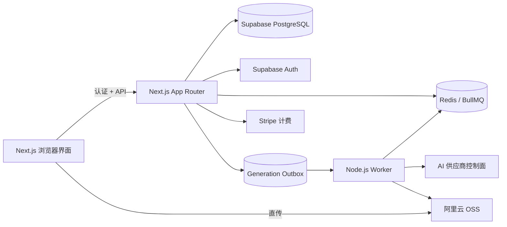

<div align="center">

# Pixel Diffusion

**开源 AI 服装与电商视觉生产工作台**

[](https://github.com/ganjmeng/wanxiangzy/actions/workflows/ci.yml)
[](LICENSE)
[](package.json)
[](package.json)
[](package.json)
[](package.json)
[](docs/CONFIGURATION.md)
[](docs/ARCHITECTURE.md)
[](docs/CONFIGURATION.md)
[](CONTRIBUTING.md)

[English](README.md) | [简体中文](README.zh-CN.md)

[在线服务](https://pixel-diffusion.com) · [配置文档](docs/CONFIGURATION.md) · [架构文档](docs/ARCHITECTURE.md) · [贡献指南](CONTRIBUTING.md)

</div>


Pixel Diffusion 是一个面向服装品牌、电商团队和内容创作者的 AI 视觉生产工作台。项目将服装上身、姿势裂变、专属模特、商品精修、商品套图、换背景、材质增强、图片翻译、服装 3D 和 AI 视频等能力整合在同一套应用中。

仓库包含完整应用源码：Next.js 前端与 API、Supabase 数据结构、AI 供应商控制面、后台 Worker、计费系统、管理后台和部署脚本。

> [!IMPORTANT]
> 仓库不包含生产密钥、托管数据库、对象存储、Redis、Stripe 商品或第三方 AI 账号。自托管需要准备自己的基础设施和服务商配置，严禁提交真实密钥。

## 核心能力

- **完整视觉工作流**：服装上身、搭配融图、姿势裂变、专属模特、商品套图、商品精修、图片翻译、换背景、材质增强和 AI 视频。
- **统一 AI 控制面**：图像、视觉、文本和视频供应商在管理后台配置，密钥加密后入库，不再散落在环境变量中。
- **可靠生成队列**：PostgreSQL Transactional Outbox、BullMQ、执行 fencing、幂等结算、重试、退款和容量背压。
- **生产级媒体链路**：浏览器直传阿里云 OSS、服务端受限抓取、生成结果持久化、媒体校验和过期清理。
- **SaaS 基础能力**：Supabase Auth、PostgreSQL、积分、Stripe 订阅与单次购买、退款、邀请奖励、审计日志和管理后台。
- **国际化界面**：多语言、RTL、响应式布局、明暗主题和可访问性基础组件。

## 产品截图

<table>
  <tr>
    <td width="50%" valign="top">
      <a href="https://vasthk.oss-cn-hongkong.aliyuncs.com/site-assets/original/home-showcase/screen-tryon-result.png">
        
      </a>
      <sub><b>服装上身</b> — 保持服装细节，参考图控制姿势与场景，并维持模特一致性。</sub>
    </td>
    <td width="50%" valign="top">
      <a href="https://vasthk.oss-cn-hongkong.aliyuncs.com/site-assets/original/home-showcase/screen-pose-result-grid.png">
        
      </a>
      <sub><b>姿势裂变</b> — 从一张原图生成多组商业姿势，同时保留服装细节和整体风格。</sub>
    </td>
  </tr>
</table>

<a href="https://vasthk.oss-cn-hongkong.aliyuncs.com/site-assets/original/home-showcase/screen-fusion-grid-reference.png">
  
</a>

<sub><b>搭配融图</b> — 将服装、配饰、参考图和模特素材组合成风格一致的商业大片。</sub>

<table>
  <tr>
    <td width="33%" valign="top">
      <a href="https://vasthk.oss-cn-hongkong.aliyuncs.com/site-assets/original/home-showcase/showcase-black-floral-dress.png">
        
      </a>
      <sub><b>商业棚拍</b> — 统一光线和服装细节，生成可直接用于商品展示的棚拍成片。</sub>
    </td>
    <td width="33%" valign="top">
      <a href="https://vasthk.oss-cn-hongkong.aliyuncs.com/site-assets/original/home-showcase/showcase-white-dress-sea.png">
        
      </a>
      <sub><b>场景生成</b> — 将服装自然放入海边场景，同时保持材质、褶皱和品牌视觉一致。</sub>
    </td>
    <td width="33%" valign="top">
      <a href="https://vasthk.oss-cn-hongkong.aliyuncs.com/site-assets/original/home-showcase/showcase-navy-shirt-pose-grid.jpg">
        
      </a>
      <sub><b>多角度输出</b> — 从同一商品方向生成可复用的姿势、角度和裁切成片。</sub>
    </td>
  </tr>
</table>

## 架构



请求链路、生成状态机、信任边界和运行时约束见 [docs/ARCHITECTURE.md](docs/ARCHITECTURE.md)。

## 技术栈

| 层 | 技术 |
| --- | --- |
| 应用 | Next.js 15、React 19、TypeScript |
| UI | Tailwind CSS、Radix Primitives、Lucide、Framer Motion |
| 状态 | Zustand、React Context |
| 认证与数据 | Supabase Auth、PostgreSQL、Row Level Security |
| 队列与 Worker | BullMQ、Redis、PostgreSQL Transactional Outbox |
| 媒体 | 阿里云 OSS、Sharp、ffprobe |
| 计费 | Stripe 订阅、单次购买、Webhook |
| AI 路由 | 管理后台配置、服务端加密的供应商控制面 |
| 质量 | ESLint、TypeScript、Vitest、Playwright、发布门禁 |

## 快速开始

### 环境要求

- Node.js 22.x（`>=22 <23`）
- npm 10+
- Supabase 项目
- Redis 7+（BullMQ 开发和生产环境）
- 阿里云 OSS（生产上传与结果持久化）
- 启用媒体校验时安装 `ffprobe`

### 1. 克隆与安装

```bash
git clone https://github.com/ganjmeng/wanxiangzy.git
cd wanxiangzy
npm ci
```

### 2. 配置环境变量

```bash
cp .env.local.example .env.local
```

至少填写你要运行的功能所需的 Supabase 和存储配置。生产密钥必须独立生成，不能使用示例值：

```bash
openssl rand -hex 32   # JOB_PROCESSOR_SECRET
openssl rand -hex 32   # UPLOAD_INTENT_SECRET
openssl rand -hex 32   # ADMIN_SECRETS_ENCRYPTION_KEY
```

完整变量说明和生产要求见 [docs/CONFIGURATION.md](docs/CONFIGURATION.md)。

### 3. 初始化 Supabase

严格按照顺序执行基础 SQL 和时间戳迁移：

```bash
export SUPABASE_DB_URL='postgresql://...'

psql "$SUPABASE_DB_URL" -v ON_ERROR_STOP=1 -f supabase/schema.sql
psql "$SUPABASE_DB_URL" -v ON_ERROR_STOP=1 -f supabase/credits-update.sql
psql "$SUPABASE_DB_URL" -v ON_ERROR_STOP=1 -f supabase/set-signup-credits-50.sql
psql "$SUPABASE_DB_URL" -v ON_ERROR_STOP=1 -f supabase/atomic-credit-rpc.sql
psql "$SUPABASE_DB_URL" -v ON_ERROR_STOP=1 -f supabase/admin-console.sql
```

后续顺序见 [docs/supabase-migration-order.md](docs/supabase-migration-order.md)。早期时间戳迁移包含破坏性变更，应用到已有数据库前必须备份。

### 4. 自动创建第一个管理员，无需手动注册

下面的命令使用 `SUPABASE_SERVICE_ROLE_KEY` 调用 Supabase Admin API，创建已确认邮箱的 Auth 用户，并同步写入 `public.admin_members`：

```bash
npm run admin:create -- --email owner@example.com --role owner
```

未传 `--password` 时脚本会生成强密码并只显示一次。重复执行会复用已有 Auth 用户，默认不修改密码；需要重置时增加 `--update-password`。这条路径不需要配置 `ADMIN_BOOTSTRAP_EMAILS`。

角色、验证 SQL 和紧急环境变量旁路见 [docs/admin-bootstrap.md](docs/admin-bootstrap.md)。

### 5. 启动应用

仅调试界面/API 时，可在 `.env.local` 中设置 `GENERATION_QUEUE_MODE=inline`：

```bash
npm run dev
```

使用真实队列时，保留 `GENERATION_QUEUE_MODE=bullmq`，配置 `REDIS_URL`，并在另一个终端启动 Worker：

```bash
npm run dev
npm run worker:dev
```

打开 [http://localhost:3000](http://localhost:3000)。

## 开发命令

| 命令 | 用途 |
| --- | --- |
| `npm run dev` | 启动 Next.js 开发服务器 |
| `npm run worker:dev` | 启动后台 Worker 监听模式 |
| `npm run test` | 运行 Vitest 测试 |
| `npm run lint` | 运行 ESLint |
| `npm run check:docs` | 检查文档链接、代码块、索引覆盖和 npm 命令 |
| `npm run typecheck` | 运行 TypeScript 类型检查 |
| `npm run build` | 创建生产构建 |
| `npm run admin:create -- --email owner@example.com` | 自动创建或授权管理员，无需手动注册 |
| `npm run check:release` | 依次运行测试、提示词回归、Lint、类型检查、构建和 SSR 体积检查 |
| `npm run check:ssr-size` | 检查服务端包体积预算 |

提交 Pull Request 前运行：

```bash
npm run check:release
```

## 生产部署

生产构建必须在本地完成，再上传到目标主机。内存受限的生产服务器上不得运行 `next build`。

```bash
SSH_HOST=<host> \
SSH_KEY=<path-to-pem> \
NODE_BIN=<remote-node-22-binary> \
./scripts/deploy-from-local.sh <tag> [worker_instances]
```

GitHub Actions 部署流程仅作为人工回退入口。推送 Git tag 不得自动触发生产部署。详见 [docs/release-checklist.md](docs/release-checklist.md)。

## 项目结构

```text
app/                  Next.js 页面与 Route Handler
components/           共享 UI 与业务组件
features/             按功能拆分的客户端流程
lib/                  领域逻辑、供应商、队列、计费、存储
scripts/              构建、Worker、迁移、审计和部署脚本
supabase/             数据库结构与有序 SQL 迁移
messages/             多语言文案
docs/                 架构与运维文档
```

## 文档索引

- [完整文档索引](docs/README.md)
- [环境变量配置](docs/CONFIGURATION.md)
- [系统架构](docs/ARCHITECTURE.md)
- [Supabase 迁移顺序](docs/supabase-migration-order.md)
- [生产生成队列](docs/production-generation-queue.md)
- [OSS 上传数据面](docs/production-upload-data-plane.md)
- [供应商结果到 OSS](docs/provider-result-oss-pipeline.md)
- [AWS EC2 发布检查表](docs/release-checklist.md)
- [备份与恢复](docs/backup-restore.md)
- [后台管理员引导](docs/admin-bootstrap.md)
- [国际化](docs/i18n.md)

## 安全

请勿在公开 Issue 中报告安全漏洞。报告流程和密钥处理要求见 [SECURITY.md](SECURITY.md)。

服务端是明确的信任边界：浏览器请求需要认证，Supabase 高权限访问仅在服务端，远程抓取使用 allowlist，上传链接有签名和边界限制，供应商密钥加密后存储。

## 欢迎提交 PR

我们欢迎社区提交 Pull Request，包括问题修复、聚焦测试、文档改进、可访问性优化、供应商适配和边界清晰的功能变更。

提交前请阅读 [CONTRIBUTING.md](CONTRIBUTING.md) 并遵守 [CODE_OF_CONDUCT.md](CODE_OF_CONDUCT.md)，运行 `npm run check:release`，并在 PR 描述中写清楚验证结果和生产影响。

[提交 PR](https://github.com/ganjmeng/wanxiangzy/compare) · [浏览 Issues](https://github.com/ganjmeng/wanxiangzy/issues) · [阅读贡献指南](CONTRIBUTING.md)

## 许可证

源代码采用 [Apache License 2.0](LICENSE)。

第三方名称、Logo、商标、模特图片、商品图片、供应商素材及其他媒体归各自权利人所有；除明确声明外，不随本仓库重新授权。详见 [NOTICE](NOTICE)。
