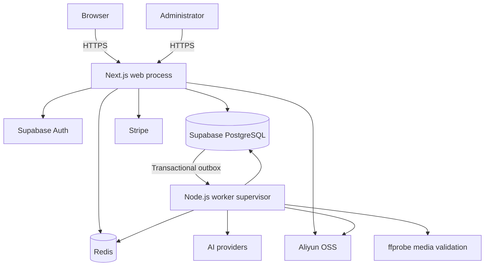

# Architecture

Pixel Diffusion is a full-stack Next.js application with a PostgreSQL source of truth, Redis-backed job delivery, object-storage media persistence, and an encrypted AI provider control plane.

## System Context

The web process accepts user requests and writes durable business intent to PostgreSQL. The worker process performs expensive or retryable work. Redis accelerates delivery and distributed capacity control, but it is not the business source of truth.

## Runtime Components

| Component | Responsibility |
| --- | --- |
| Next.js web process | UI, authentication, API routes, billing callbacks, upload signing, read models |
| Supabase Auth | User identity and session lifecycle |
| Supabase PostgreSQL | Users, profiles, generations, credits, billing, outbox, audit, assets, task queue |
| Redis | BullMQ delivery, distributed provider capacity, admission limits, task-cache hot data |
| Worker supervisor | Generation execution, outbox relay, OSS mirroring, media validation and cleanup |
| AI provider control plane | Encrypted provider configuration, protocol adapters, routing, fallback, capacity |
| Aliyun OSS | User uploads, generated results, provider result persistence, site media |
| Stripe | Subscriptions, one-time purchases, webhook events, refunds |

## Request Flow

1. The browser authenticates through Supabase Auth.
2. A feature API validates the session, request schema, ownership, upload rules, and current entitlements.
3. Database RPCs atomically debit credits and create a generation or product-retouch batch.
4. The same transaction writes a delivery record to the generation outbox.
5. The outbox relay claims work with `SKIP LOCKED` and publishes a BullMQ job.
6. A worker claims the generation with a delivery version and execution token.
7. Provider calls run under bounded concurrency and distributed capacity limits.
8. Successful media is persisted and registered; failed slots are settled and refunded according to policy.
9. The browser reads generation/task state from PostgreSQL-backed APIs and can subscribe to realtime changes where enabled.

## Generation State and Invariants

The generation system is designed around these invariants:

- PostgreSQL is authoritative for credits, generation state, refunds, and outbox delivery.
- Redis can be rebuilt from PostgreSQL if queue state is lost.
- A generation is not executed because a worker received a message alone; the database claim must still be valid.
- Delivery version and execution token prevent stale workers from committing after a lease changes.
- Credit debit, generation creation, and outbox creation are committed atomically.
- Provider calls are retried only when the operation is safe to repeat or keyed for idempotency.
- Failed outputs are settled independently so one failed image does not corrupt an entire batch.
- Capacity waits and stale leases are recoverable without manual database edits.

Detailed queue behavior is documented in [production-generation-queue.md](production-generation-queue.md).

## AI Control Plane

AI provider configuration is managed from the admin console rather than hardcoded in feature code.

The control plane provides:

- Provider endpoints, credentials, protocol adapters, and model metadata.
- Capability routing for image, vision, text, and video operations.
- Cost, priority, capacity, health, and fallback decisions.
- AES-256-GCM encryption for provider credentials at rest.
- Test requests and publication workflows separated from runtime reads.

The application supports multiple provider protocols, including OpenAI-compatible APIs, Gemini-native image APIs, Kie task APIs, and provider-specific video APIs. Treat provider output as untrusted until it passes size, host, type, and media validation.

See [ai-model-control-plane.md](ai-model-control-plane.md) and [ai-toolbox-provider-integration.md](ai-toolbox-provider-integration.md).

## Media and Storage

Production follows a browser-to-OSS upload path:

1. The server validates the user, purpose, file size, MIME type, and daily quota.
2. The server signs a short-lived PostObject policy bound to the user, purpose, key, size, and content type.
3. The browser uploads directly to OSS.
4. The application records and verifies the resulting asset.

Generated results may arrive from temporary provider URLs. The worker persists them through a bounded remote transfer path with explicit host allowlists and private-address protections. Media validation uses `ffprobe` for video and retention cleanup removes expired or unreferenced temporary objects.

See [production-upload-data-plane.md](production-upload-data-plane.md), [provider-result-oss-pipeline.md](provider-result-oss-pipeline.md), and [oss-remote-stream-worker.md](oss-remote-stream-worker.md).

## Security Boundaries

- Browser input is untrusted.
- The Supabase anon key is public; RLS and server-side authorization protect user data.
- The Supabase service-role key is server-only and must never reach the browser.
- Provider keys and processor secrets are server-only.
- Server-side remote fetches use explicit host allowlists and reject private or reserved addresses after DNS resolution, including all resolved answers.
- Upload receipts are signed, scoped, and short-lived.
- Stripe webhooks are signature-verified and processed idempotently.
- Administrative actions are role-gated and audited.

Never weaken one of these checks merely to make a provider or integration work. Add the narrow hostname, operation, scope, or capability that is actually required.

## Deployment Model

The supported production model is a local production build uploaded to a target host:

- Build `.next` on a developer Mac or other adequately sized machine.
- Transfer the immutable build with `scripts/deploy-from-local.sh`.
- Run the web process and worker under PM2 or an equivalent process manager.
- Keep `.env.production` outside the source tree on the host.
- Apply database migrations before starting code that requires the new contract.
- Validate the runtime contract and required RPCs before switching traffic.

GitHub Actions may be used only as a manually dispatched fallback. A tag push must not deploy automatically.

## Observability and Operations

Operational visibility should cover:

- HTTP error rate and latency by route.
- Generation admission, active work, retries, stalls, and settlement/refund outcomes.
- Outbox backlog, relay latency, and BullMQ waiting/active/failed counts.
- Provider health, capacity waits, fallback selection, and error classification.
- OSS mirror success, transfer failures, and media validation outcomes.
- Worker heartbeat, RSS, heap, event-loop delay, and graceful shutdown.
- Database connection pressure, slow queries, and storage growth.

Use [production-generation-queue.md](production-generation-queue.md), [release-checklist.md](release-checklist.md), and [backup-restore.md](backup-restore.md) as the operational baseline.

## Extension Points

New capabilities should fit one of these layers:

- **Feature UI** under `features/` or route-specific `app/` files.
- **Shared UI** under `components/`.
- **Domain logic** under `lib/`.
- **Provider adapter** under the AI control plane and provider registries.
- **Durable job** through PostgreSQL outbox plus BullMQ and a worker handler.
- **Database change** through an ordered, timestamped migration.
- **Operational change** through documented scripts, configuration, and release gates.

Avoid adding provider-specific branching directly to UI components. Keep provider contracts, validation, and persistence at the server boundary.
