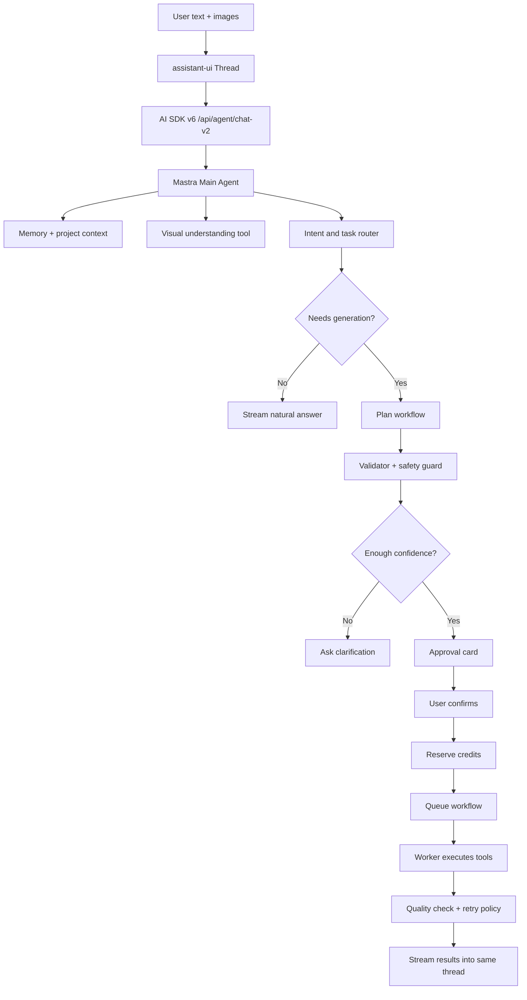

# Next-generation Agent Architecture

## Decision

The next production architecture should use:

```text
assistant-ui        User-facing GPT-like chat experience
AI SDK v6           Streaming protocol, UI messages, tool calls, approvals
Mastra              Agent runtime, workflows, memory, evals, traces
Existing services   Try-on, pose variation, text/image generation, 3D, credits, jobs
Supabase            Auth, storage, persistence, audit data
EC2                 Current production deployment target
```

This is not a rewrite of every business module. It is a controlled migration from a custom chat/agent state machine to a standard agent runtime and UI protocol.

## Why This Stack

### assistant-ui

Use assistant-ui for the browser chat surface because the current hand-written UI has become too rigid. It should own:

- Thread layout and GPT-like message flow.
- Attachments and image references.
- Tool-call cards and approval UI.
- Collapsible reasoning or process views.
- Feedback controls.
- Custom message parts for generation results and workflow cards.

assistant-ui is the user-facing layer. It is not the Agent brain.

### AI SDK v6

Use AI SDK v6 as the protocol and streaming layer because it gives us a standard way to move rich agent events between backend and frontend:

- `useChat` transport and UI message streams.
- Tool-call parts.
- Multi-step tool execution.
- Human approval flow.
- Provider-agnostic model calls.
- Future video/image model routing through a consistent API.

AI SDK v6 should not be treated as the complete product. It is the pipe and runtime contract between UI and Agent.

### Mastra

Use Mastra for backend Agent production structure:

- Agents with memory and tool calling.
- Deterministic workflows for visual tasks.
- Agent networks when a single agent is not enough.
- Evals, traces, logs, and observability.
- Human-in-the-loop execution points.
- Runtime context and guardrails.

Mastra replaces the custom Brain v2 orchestration over time, but the migration should happen behind a feature flag.

## Model Routing

The production Agent should use the same Xiaomi Mimo OpenAI-compatible endpoint as the existing analysis layer whenever Xiaomi credentials are configured:

```env
XIAOMI_MIMO_API_KEY=...
XIAOMI_MIMO_BASE_URL=https://token-plan-cn.xiaomimimo.com/v1
AGENT_MASTRA_MODEL=mimo-v2.5-pro
```

`AGENT_MASTRA_MODEL` is treated as the Xiaomi model id in this mode. If it contains a gateway-style slug such as `openai/gpt-5.4`, the Agent ignores that value for Xiaomi calls and falls back to `XIAOMI_MIMO_TEXT_MODEL`, `XIAOMI_MIMO_MODEL`, or `mimo-v2.5-pro`. If no Xiaomi key exists, Mastra can still fall back to an AI SDK gateway model for local development.

## Target Product Behavior

There should be one default experience: Agent mode.

The user should not need to choose between many modes. The system decides:

```text
Casual conversation       Answer naturally, no planning panel, no credits
Image analysis            Explain or ask follow-up, no generation unless requested
Simple generation         Ask for confirmation when credits/tools are needed
Multi-step visual task    Plan workflow, show concise confirmation, then execute
Repair / retry            Use previous task context and improve the failed result
Ambiguous request         Ask one short clarification question
```

Optional Chat mode can remain as a small escape hatch:

```text
Agent  Default. Can chat, plan, and generate after confirmation.
Chat   Only answer/analyze. Never deduct credits or start generation.
```

No other visible modes should be needed for normal users.

## Production Flow



## Backend Shape

Add a new namespace without deleting the current system:

```text
lib/mastra/
  index.ts
  agents/
    main-agent.ts
    chat-agent.ts
    visual-agent.ts
    critic-agent.ts
  tools/
    analyze-images-tool.ts
    create-workflow-tool.ts
    confirm-workflow-tool.ts
    tryon-tool.ts
    pose-variation-tool.ts
    text-to-image-tool.ts
    image-to-image-tool.ts
    commerce-detail-tool.ts
    garment-3d-tool.ts
    quality-check-tool.ts
    credit-tool.ts
  workflows/
    visual-generation-workflow.ts
    tryon-pose-workflow.ts
    commerce-detail-workflow.ts
    garment-3d-workflow.ts
  memory/
    user-preferences.ts
    project-context.ts
  evals/
    intent-routing.eval.ts
    visual-workflow.eval.ts
    regression-cases.eval.ts
  adapters/
    current-workflow-adapter.ts
    current-generation-adapter.ts
    current-credit-adapter.ts
```

Add new API routes while keeping current routes alive:

```text
app/api/agent/chat-v2/route.ts
app/api/agent/threads/route.ts
app/api/agent/approvals/route.ts
```

`chat-v2` should stream AI SDK UI messages. The old `/api/agent/chat` remains available behind rollback.

## Tool Contract

Every production capability must be a typed tool:

```text
Tool input:
  user intent
  image refs
  workflow context
  user constraints
  model settings

Tool output:
  status
  user-visible summary
  generated asset refs
  cost estimate or final cost
  trace id
  quality result
  recoverable error
```

Tools must not directly trust free-form LLM output. Each tool needs:

- Zod input schema.
- Deterministic validation.
- Cost policy.
- Capability check.
- Timeout and retry policy.
- Audit event.
- Idempotency key when it creates or charges anything.

## Existing Capability Mapping

```text
Current module           Mastra tool/workflow
-------------------------------------------------------------
General generation       text-to-image-tool / image-to-image-tool
Try-on                   tryon-tool
Pose variation           pose-variation-tool
Garment 3D               garment-3d-tool
Commerce detail page     commerce-detail-workflow
Workflow planner         create-workflow-tool
Workflow confirm         confirm-workflow-tool
Credit reservation       credit-tool
Quality eval             quality-check-tool
Agent evals              Mastra evals + existing eval tables
Trace panel              Mastra trace + existing agent_brain_traces
```

The current worker endpoints can stay:

```text
/api/jobs/process-agent-workflows
/api/jobs/process-generations
/api/jobs/run-agent-evals
```

Mastra tools should call the existing repository/runtime layer first. Later, workers can be replaced or split if needed.

## UI Shape

Replace the custom chat composition gradually:

```text
components/agent-v2/
  AgentShell.tsx
  Thread.tsx
  Composer.tsx
  AttachmentTray.tsx
  ToolPartRenderer.tsx
  WorkflowApprovalCard.tsx
  WorkflowResultCard.tsx
  GenerationResultGrid.tsx
  ReasoningDisclosure.tsx
```

UI rules:

- Normal chat should look like ChatGPT: no forced planning block.
- Reasoning/process is collapsed by default.
- Planning appears only when there is a real task to execute.
- Confirmation cards should be short and concrete.
- Tool progress should stream in-place, not as separate noisy messages.
- Generated images replace the loading slots they belong to.
- One image is large, two images are paired, three or four images use a grid.
- Feedback should create eval cases automatically.

## Human Approval

Any action that spends credits, creates assets, or runs an external generation model requires approval.

Approval should include:

```text
Goal
Input image roles
Planned steps
Output count and aspect ratio
Estimated credits
Known risks
Confirm / edit / cancel actions
```

The approval card is a product component, not raw model text.

## Memory

Memory should be split by type:

```text
User preferences
  brand tone
  preferred aspect ratios
  frequent model/provider choices
  disliked styles

Project context
  active product
  active garment set
  recent workflow outputs
  chosen image roles

Long-term knowledge
  brand assets
  product library
  reusable campaign style
```

Rules:

- Current user instruction always overrides memory.
- Memory can suggest defaults, not silently change user intent.
- Any learned preference should include source and timestamp.
- Negative feedback must be converted into eval/regression cases.

## Eval And Quality Loop

Keep the current eval endpoints, then connect them to Mastra evals.

Minimum production eval suites:

```text
Intent routing:
  chat vs analysis vs generation vs workflow

Image role detection:
  garment/person/reference/background/product

Workflow planning:
  tryon -> pose
  commerce detail
  3D product display
  generic text-to-image
  generic image-to-image

Safety:
  no credits without approval
  disabled video blocked but preserved as future-ready output
  ambiguous image roles ask clarification

UX:
  casual chat does not show planning UI
  tool progress collapses by default
```

Quality loop:

```text
User bad feedback -> eval case -> nightly eval -> regression report -> prompt/tool fix
Generation output -> visual quality evaluator -> quality_checked event -> optional prompt repair retry -> health/observability report
```

## Feature Flags

Add explicit rollout switches:

```env
AGENT_RUNTIME_PROVIDER=legacy|mastra
AGENT_UI_PROVIDER=legacy|assistant_ui
AGENT_CHAT_V2_ENABLED=false
AGENT_MASTRA_TRACE_ENABLED=true
AGENT_MASTRA_EVAL_ENABLED=true
AGENT_MASTRA_MEMORY_ENABLED=false
AGENT_WORKFLOW_QUALITY_REPAIR_ENABLED=true
AGENT_WORKFLOW_QUALITY_REPAIR_MAX_ATTEMPTS=1
```

Rollout plan:

```text
0%   local only
5%   internal users
20%  selected production users
50%  all new conversations
100% default
```

Rollback should be one environment variable change:

```env
AGENT_RUNTIME_PROVIDER=legacy
AGENT_UI_PROVIDER=legacy
```

## Migration Phases

### Phase 1: Foundation

- Install dependencies.
- Add `chat-v2` route.
- Add Mastra skeleton and adapters.
- Add assistant-ui shell behind feature flag.
- No production traffic by default.

### Phase 2: Chat parity

- Make normal chat stream through AI SDK v6.
- Preserve conversation persistence.
- Preserve attachments.
- Hide planning UI for casual chat.
- Add basic feedback events.

### Phase 3: Workflow parity

- Wrap existing workflow planner as Mastra tools.
- Confirm card uses tool approval.
- Execute existing workflow runtime unchanged.
- Stream workflow status back into assistant-ui tool parts.

### Phase 4: Agent upgrade

- Replace custom router with Mastra main agent.
- Add visual understanding tool.
- Add critic/verifier tool.
- Add memory injection.
- Add eval report integration.

### Phase 5: Production hardening

- Gradual rollout.
- Trace comparison between legacy and Mastra.
- Nightly eval reports.
- Failure dashboards.
- Cost monitoring.
- Rollback drill.

## What Not To Do

- Do not replace all generation modules at once.
- Do not expose many modes to users.
- Do not show every internal Agent step for normal chat.
- Do not use keyword matching as the primary route.
- Do not let LLM output spend credits directly.
- Do not remove existing cron/job routes until Mastra workflow execution has proven stable.
- Do not enable video execution yet, but keep the tool contract ready.

## Acceptance Criteria

The migration is production-ready when:

- Casual chat feels natural and streams like GPT.
- Image tasks are routed semantically, not by brittle keywords.
- Workflow tasks show concise plans only when useful.
- All credit-spending tools require approval.
- Existing try-on, pose, commerce detail, generic generation, and 3D modules still work.
- Results appear in the correct message/tool slot.
- Bad feedback becomes eval cases.
- Nightly evals run and produce reports.
- Traces explain why a route/tool was chosen.
- Legacy runtime can be restored without database rollback.

## Recommended First Implementation PR

The first PR should be small but structural:

```text
1. Add AI SDK v6, assistant-ui runtime, and Mastra dependencies.
2. Add /api/agent/chat-v2 route returning AI SDK UI message stream.
3. Add lib/mastra skeleton with one main agent and one echo/chat tool.
4. Add assistant-ui AgentShell behind AGENT_UI_PROVIDER.
5. Keep old /agent page as default until flag is enabled.
6. Add smoke tests for chat-v2 and feature-flag fallback.
```

After that, migrate tool by tool.
